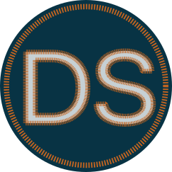
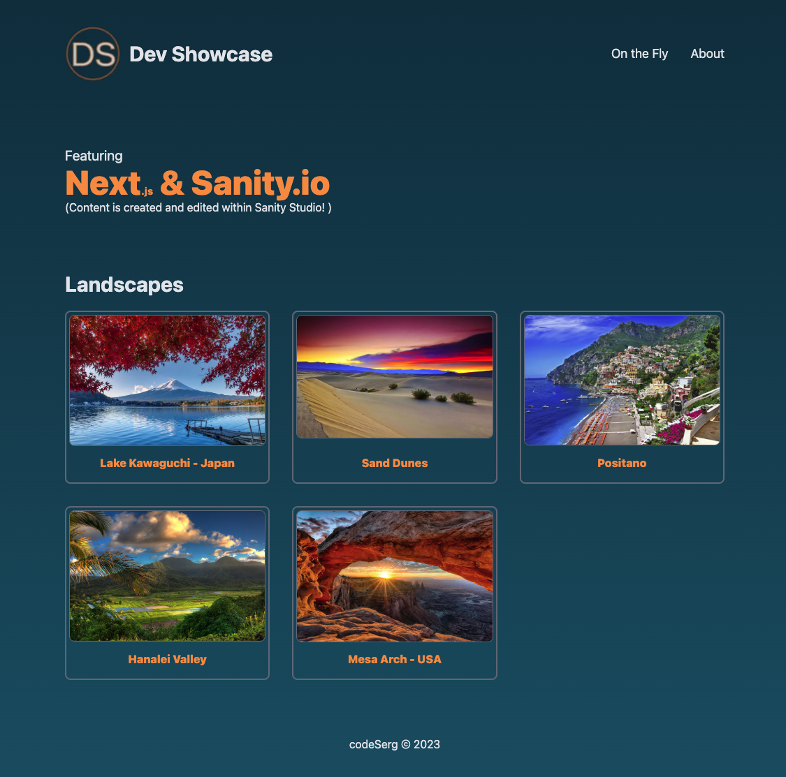

  

    
  

  

    
    
   
   
  

# Dev Showcase

Dev Showcase is a [Next.js](https://nextjs.org/) project bootstrapped with [`create-next-app`](https://github.com/vercel/next.js/tree/canary/packages/create-next-app).  
It integrates Sanity Studio [Sanity.io](https://www.sanity.io) as a tool to allows users to create and edit content.

   

## Features

- **Content Creation**: Allow users to create/edit/delete content.
- **Page Creation**: Allow users to create pages that are dynamically linked in the header.
- **Server Side Rendering**: HTLM is pre-rendered on the server -> Improved SEO, lighter client, faster performance

## Tech

- **Backend**: Sanity.io
- **Frontend**: Next.js with integrated Sanity.io Studio
- **Other**: Typescript, Tailwind.css

## Installation / Usage

1. Clone the repository:  
   `git clone https://github.com/code-serg/showcase-next-sanity`

2. Install dependencies:  
   `npm install`  

3. Sanity Account
   Get your free account with Sanity.io
   Create a project, get the project ID

4. Set up your `.env` file with necessary environment variables (use `.example.env` as template and adjust as needed):

   - Sanity ProjectId and Dataset

5. Run the application:
   `npm run dev`

6. Open [http://localhost:3000](http://localhost:3000) with your browser to see the result.

## Issues / Improvements

- Implement catch-all URL redirect.
- Customize Sanity Studio editing features

## Credits

Thanks to Kapehe from Sanity.io for the integration walk-through.

## License

This project operates under the MIT License.
